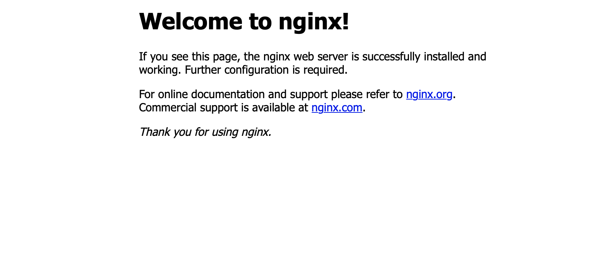

# How to configure Nginx with SSL as a reverse proxy for Embold

By default, Embold comes with its own built-in web server, which listens on port 3000. This is good to get started. Once you have real production data going to your host, though, it’s a good idea to configure nginx (or any other proxy) as a reverse proxy on top of Embold and enable SSL.


This article explains how to setup and configure nginx for Embold, and enable SSL powered by Let's Encrypt.

## Pre-requisites
- This article assumes you have already installed Embold server instance (version 1.8.3.0 or higher as of this writing) and have a valid and activated license)
- If you haven't yet installed Embold already, [Request a trial account](https://embold.io/on-premise-request)
- You are running the Embold server via docker or natively on an Ubuntu host
- You have a domain name assigned to the host running Embold (in this example we will use `scantest.emboldci.dev`)
- This article assumes your Embold server is running on port 3000 (the default port)

## Install and Configure Nginx

Run the following commands to install nginx:

```sh
sudo apt-get update
sudo apt-get install nginx
```
You should now be able to see this page:



- Now create a new configuration file at `/etc/nginx/sites-available` for your domain (in our example it is `scantest.emboldci.dev`).
- Add the following content to this file (`/etc/nginx/sites-available/scantest.emboldci.dev`):

```nginx
server {
    listen 80 default_server;
    listen [::]:80 default_server;
    server_name scantest.emboldci.dev;
    if ($http_x_forwarded_proto = '') {
        set $http_x_forwarded_proto  $scheme;
    }
    chunked_transfer_encoding on;
    client_max_body_size 0;
    location / {
        proxy_read_timeout  900;
        proxy_pass_header   Server;
        proxy_cookie_path   ~*^/.* /;
        proxy_pass http://localhost:3000/;
        proxy_set_header X-Forwarded-Port $server_port;
        proxy_set_header X-Forwarded-Proto $http_x_forwarded_proto;
        proxy_set_header Host $http_host;
        proxy_set_header X-Forwarded-For $proxy_add_x_forwarded_for;
    }
}
```

Next, cd to `/etc/nginx/sites-enabled` and create this soft link:

```sh
sudo ln -s /etc/nginx/sites-available/scantest.emboldci.dev
```

Now restart nginx

```sh
sudo service nginx restart
```


## Enable SSL with Let's Encrypt

Now let’s enable SSL on nginx, powered by Let’s Encrypt.

Run these commands:
```sh
sudo add-apt-repository ppa:certbot/certbot
sudo apt install python-certbot-nginx
sudo certbot --nginx -d scantest.emboldci.dev
```
When running certbot, make sure you select the "redirect" option to redirect HTTP traffic to HTTPS

Now you should be able to access http://scantest.emboldci.dev, which will redirect to HTTPS with a Let's Encrypt certificate

## Don't forget!
Make sure you disable external access to port 3000 on your host (e.g. via firewall configuration on your host or service provider)
