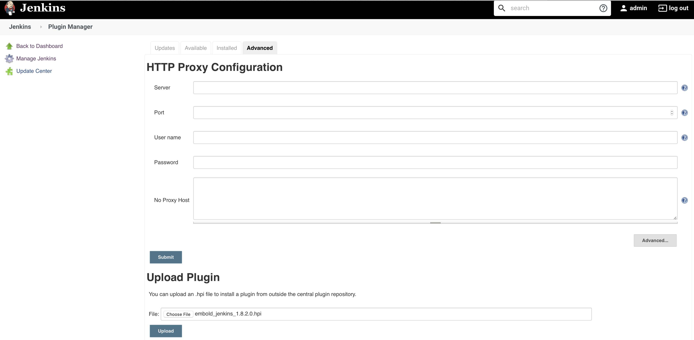
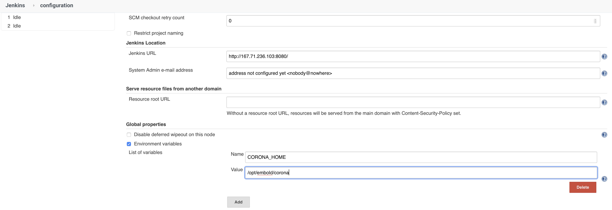
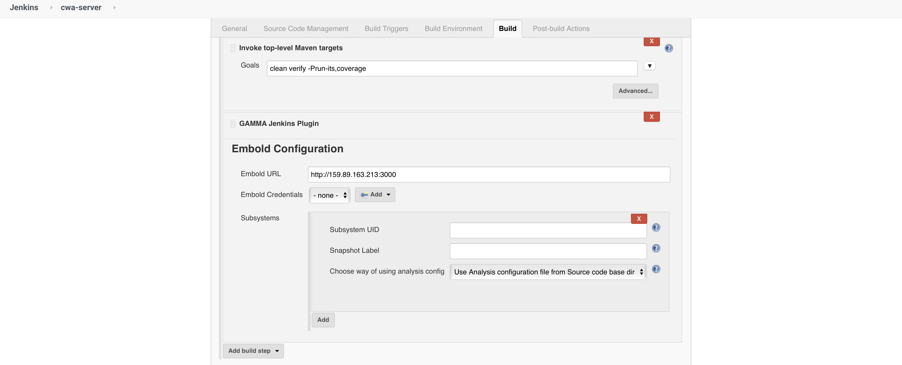
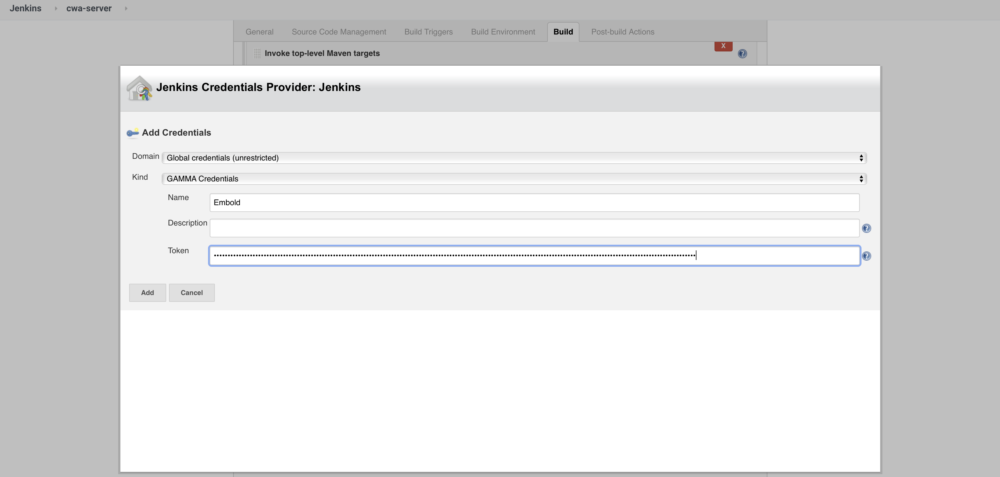
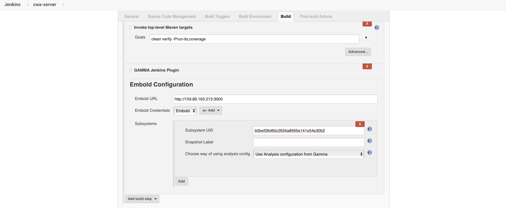
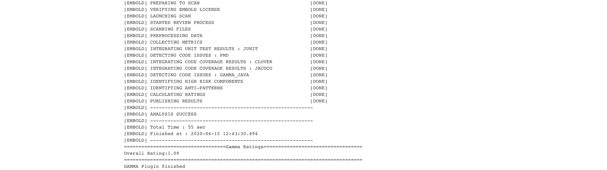
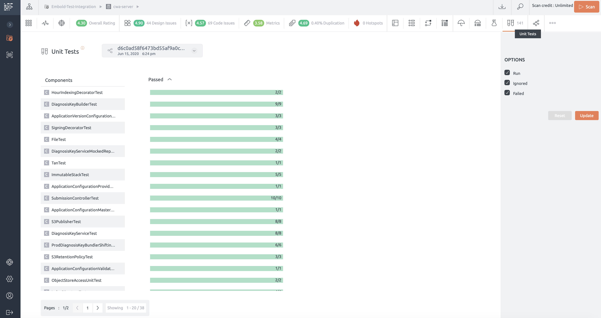
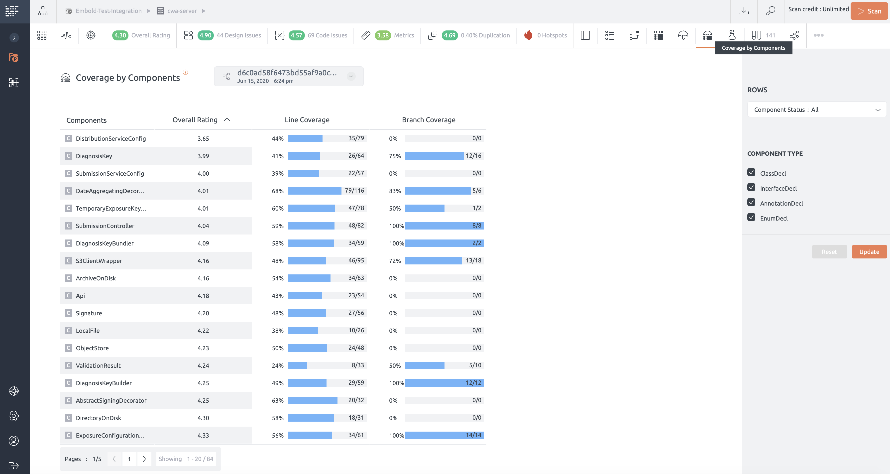
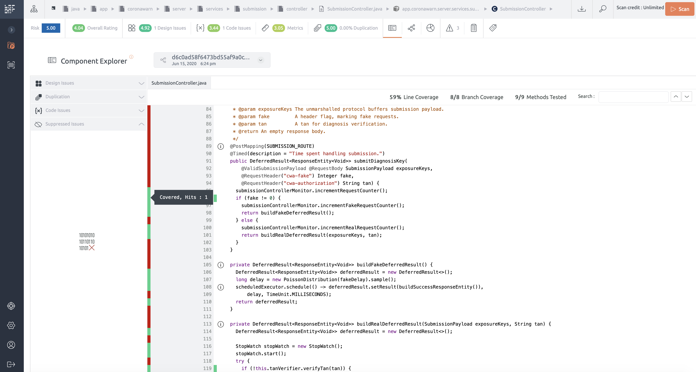

# Embold Scan in remote mode with test and coverage data integration
Embold's Analyser component can be run on a separate machine than the Embold Server in order to support use-cases such as CI workflows, scanning with build, unit test and coverage data integration.
In this case, the scan happens on a machine such as the build machine, and the scan results are published to the Embold Server.
In this article, we will look at:
- How to use the Embold Jenkins plugin
- How to run a scan through the Jenkins build and publish results to the Embold Server
- How to publish unit test and coverage data along with the scan results

 We will do this with a sample Java project which is built with maven, uses Junit to run tests and Jacoco to collect coverage data.

**Note:** this scenario is specific to Embold running on-premise, and not applicable to Embold cloud.

The typical setup for this is as shown below:

```console
|---------------------------|                       |---------------------------|
|   Jenkins Build Machine   |                       |                           |
|                           |                       |                           |
|   Embold Jenkins Plugin   |                       |                           |
|                           |            3000 (web) |       Embold Server       |
|      Embold Analyser      |----------------> *----|                           |
|      (a.k.a corona)       |----------------> *----|                           |
|                           |           5432 (data) |                           |
|---------------------------|                       |---------------------------|
```
In this scenario, you install the Embold Jenkins plugin and also deploy the Embold Analyser (corona) on the Jenkins host. In this example, let's assume the build and Embold scan runs on the master (though you can also run it on Jenkins slave)


### Pre-requisites
- Embold Server is setup in your environment (if not, [Request a trial account](https://embold.io/on-premise-request))
- Embold Server ports (default 3000 for web and 5432 for data) are accessible from the Jenkins host where the scan will run
- You have rights to create a Project and Repository in Embold
- Access to the **Embold Corona** archive file (corona-archive.tar.gz version 1.8.2.0 or later, as of this writing) - you can download this from your embold.io account:
Releases -> embold_1.8.2.0 -> Corona -> linux -> corona_1.8.2.0.tar.gz
- Access to the **Embold Jenkins Plugin** archive file (embold-jenkins.hpi version 1.8.2.0 or later, as of this writing) - you can download this from your embold.io account: Releases -> embold_1.8.2.0 -> Plugins -> CI_CD -> jenkins -> embold_jenkins_1.8.2.0.hpi
- JRE 8 or later is installed on the Jenkins host where we will run the scan
- You already have a Jenkins job which builds your project and runs Junit tests along with Jacoco code coverage


### Setup and Configuration
In this example, we will scan the corona-warn-app server (Java): https://github.com/corona-warn-app/cwa-server.git

1. Install the Embold Jenkins plugin via the Jenkins Plugin Manager -> Advanced -> Upload Plugin section:



2. Now create a **Project** in Embold Server, which will hold the repository we want to scan. More info here: <https://docs.embold.io/projects-repositories/#create-a-project>

3. Next, link a new **Remote Repository** to this Project and give it a name, e.g. `cwa-server`. More info here: <https://docs.embold.io/projects-repositories/#link-a-repository>
    
    Make sure the **Repository Type** is **Remote** and the Language is set to **Java**

4. Make sure you **do not** exclude any test code in this repository (as in this example we need to report tests). You do this by removing the default exclusions in the scan configuration:

Select the **"..."** option on the **Remote Repository** we just created, and then the "Scan configuration" option, and then delete the default exclusions in the "exclusions" section


5. Download the corona_1.8.2.0.tar.gz to a location on the Jenkins host where the user `jenkins` has execute access. In this example, we will copy it to `/opt/embold` and change ownership to `jenkins` user so Jenkins can launch the scan

```sh
$ sudo tar xvf corona_1.8.2.0.tar.gz -C /opt/embold
$ sudo chown -R jenkins /opt/embold/corona
```

6. Set **CORONA_HOME** environment variable in Jenkins to `/opt/embold/corona`:



7. Now configure your Jenkins build to include a Build Step where we will run the Embold Jenkins plugin:



8. Create Embold (GAMMA credentials) so the plugin can authenticate with the Embold Server:

- Generate your **Embold Access Token** from the Embold Server and paste the token in the Jenkins credentials config (More info on Embold Access Token here: <https://docs.embold.io/gamma-access-token-gat/#gamma-access-token-gat>)



9. Complete the plugin configuration:



Note that we selected the "Embold" credentials we just created, and then specified the Embold repository UID where the scan results will be published

**Note:** You can copy the repository UID from the Embold Server by selecting the **"..."** option on the **Remote Repository** we just created, and then the "More information" option

Make sure you use the **Use Analysis configuration from Gamma** option, which works with most default configuration (e.g. it looks for the usual locations where JUnit and Jacoco data is published)

10. Save the Jenkins job configuration and run the build
If all goes well, you should see the following log towards the end of the build:



11. Now head to your Embold Server and the Repository we created. You should see Unit tests and Code Coverage results:

- Unit Test results:



- Code coverage information:

If you integrated code coverage in your build (in this case Jacoco), you will also see coverage info:



The coverage info (line / branch coverage) is also overlaid in the component explorer:




12. For more info: https://docs.embold.io
